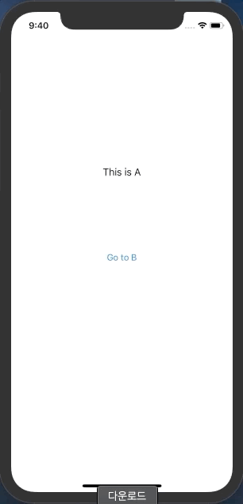

### 과제 1번

3개의 뷰 컨트롤러 사이에 화면 전환하기

A는 B로 가는 버튼

B는 A로 돌아가는 dismiss 버튼과 C로 가는 버튼

C는 A 또는 B로 돌아가는 dismiss 버튼

#### 결과




#### 주요내용

##### 1. 스토리보드로 생성한 View Controller 소스코드에서 참조하는 방법

```swift
 @IBAction func goToBButton(_ sender: UIButton) {
     let mainStoryboard = UIStoryboard.init(name: "Main", bundle: nil)
     
     let vcB = mainStoryboard.instantiateViewController(identifier: "ViewControllerB")
     vcB.modalPresentationStyle = .fullScreen
     present(vcB, animated: true)
 }
```

##### 2. presentingViewController에 실제로 포인터가 할당되는것 확인

```swift
    @objc func bButtonAction(_ sender: UIButton) {
        guard let vcB = self.presentingViewController as? ViewControllerB else {
            return
        }
        print("ViewControllerC.presentingViewController is \(vcB)") // ViewControllerB에 대한 정보(포인터)가 출력됨.
				//...
    }
    
    @objc func aButtonAction(_ sender: UIButton) {
        guard let vcA = self.presentingViewController?.presentingViewController as? ViewControllerA else {
            return
        }
        print("ViewControllerC.presentingViewController?.presentingViewController is \(vcA)") // ViewControllerA에 대한 정보(포인터)가 출력됨.
        //...
    }
```


### 과제 2번

ViewController 데이터 전달

AViewController 와 BViewController 를 만든 뒤, 각각 하나씩의 Label 생성

A에서 B로 화면을 넘어갈 때는 B의 La bel 값이 이전 값에서 +3 증가

B에서 A로 화면을 넘어갈 때는 A의 Label 값이 이전 값에서 +1 증가

e.g. A에서 B로 갈 때 3, B에서 다시 A로 넘어올 때 4, 다시 A에서 B로 가면 7, 다시 A로 오면 8

#### 결과


#### 주요내용

##### 1. 데이터 전달 하는 방법

인스턴스 생성을 통해 상대방의 프로퍼티에 접근하여 값을 바꿔줌

```swift
// A->B
@objc func goToBAction(_ sender: UIButton) {
    let vcB: ViewControllerB = ViewControllerB() // 뷰 B의 인스턴스 생성
    vcB.countFromA = countFromB + 3 // 뷰 B의 프로퍼티 countFromA로 값 전달
    vcB.modalPresentationStyle = .fullScreen
    present(vcB, animated: true)
}

// B->A
@objc func goToAAction(_ sender: UIButton) {
    guard let vcA = self.presentingViewController as? ViewControllerA else {
        return
    } // 뷰 A 객체를 읽어온 다음 ViewControllerA 타입으로 다운캐스팅
    vcA.countFromB = countFromA + 1 // 뷰 A의 프로퍼티 countFromB로 값 전달
    vcA.dismiss(animated: true)
}
```


### 도전 과제

카드 스타일에서 제스처로 내릴 때는 UIAdaptivePresentationControllerDelegate 프로토콜을 사용한 별도의 작업 필요.

관련 내용을 검색해보고 presentationControllerDidDismiss 메서드를 이용해서 구현해보기