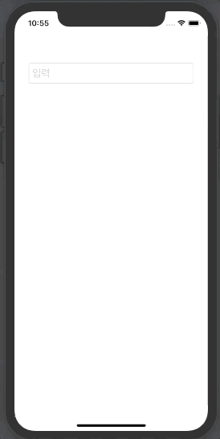
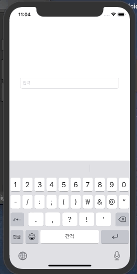

## 문제 1번
텍스트 필드에 어떤 값을 입력하면 별도의 Label 에 입력된 텍스트 표시.
텍스트 필드가 활성화 되어 있을 땐 Label 의 텍스트 색상이 파란색이고, Font 크기는 40
텍스트 필드가 비활성화되면 Label 텍스트 색상이 빨간색이고, Font 크기는 20
<br>

## 답안


### 주요내용

* 텍스트 필드 터치시 최초응답자 설정
```swift
@objc func tfTouchUpInside(_ sender: UITextField) {
    self.colorTF.becomeFirstResponder()
}
```
* 키 입력이 시작되면 폰트 크기와 색 변경
```swift
@objc func tfEditingDidBegin(_ sender: UITextField) {
    colorTF.textColor = .systemBlue
    colorTF.font = .systemFont(ofSize: 40)
}
```
* 키 입력이 끝나면(return 입력) 폰트 크기와 색 변경
```swift
@objc func tfEditingDidEnd(_ sender: UITextField) {
    colorTF.textColor = .systemRed
    colorTF.font = .systemFont(ofSize: 20)
}
```
<br>

## 문제 2번
텍스트필드에 10글자까지만 입력되고 그 이상은 입력되지 않도록 하기

## 답안


### 주요내용
* TextFieldDelegate 구현
```swift
class ViewController: UIViewController, UITextFieldDelegate { // Delegate protocol 채택

    var inputText: String = ""
    @IBOutlet var myText: UITextField!
    
    override func viewDidLoad() {
        super.viewDidLoad()
        // Do any additional setup after loading the view.
        
        myText.delegate = self // delegate 할당(?)
    }
```
* TextFieldDelegate 메소드 작성(입력 금지 기능)
```swift
class ViewController: UIViewController, UITextFieldDelegate {
    // code...
    override func viewDidLoad() {
    // code...
    }
    
    func textField(_ textField: UITextField, shouldChangeCharactersIn range: NSRange, replacementString string: String) -> Bool {
        if textField.text!.count > 10 {
            return false
        }// 텍스트 필드 입력이 10개가 넘으면 false 반환(입력 금지)
        return true
    }
    
    // code...
}    
```