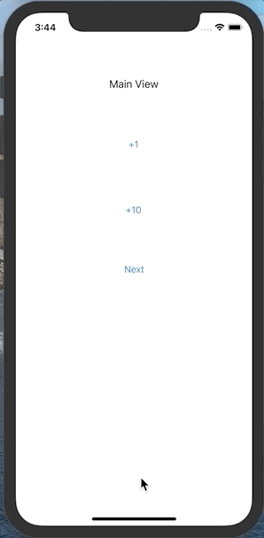

# 과제

## 1번

secondVC가 띄워질 때마다 숫자를 증가시키는데, firstVC에서 하나는 1씩 값을 올리고 다른 하나는 10씩 올려주는 버튼 만들기 (identifier - PlusOne / PlusTen)

### 답안



### 주요내용

* 데이터 전송(첫번째 뷰 -> 두번째 뷰)

  * 첫번째 뷰: 해당 Segue의 목적지를 두번째 뷰로 타입캐스팅해서 인스턴스 생성 후 프로퍼티를 참조해 값을 할당
  * 두번째 뷰: 해당 프로퍼티의 값을 라벨의 텍스트값에 할당한다.

  ```swift
  // 첫번째 뷰
  override func prepare(for segue: UIStoryboardSegue, sender: Any?) {
      guard let secondVC = segue.destination as? SecondViewController else { return } // 인스턴스 생성
      
      switch segue.identifier {
      case "plusOneSeg":
          storeCount += 1
          secondVC.countValue = storeCount
        // code...
      }
  }
  
  // 두번째 뷰
  @IBOutlet weak var countValueLabel: UILabel!
  var countValue: Int = 0
  var userInputValue: Int = 0
  
  override func viewDidLoad() {
      super.viewDidLoad()
      countValueLabel.text = String(countValue) // 첫번째 뷰를 통해 전달 받은 값을 할당
  }
  ```


* 두번째 뷰에서 데이터 가져오면서 전환하기

  * 첫번째 뷰에 작성된 unwind 메소드에 두번째 뷰 인스턴스를 생성 후 해당 프로퍼티를 참조해서 값을 가져온다.

  ```swift
  // 첫번째 뷰
  @IBAction func unwindToViewController(_ unwindSegue: UIStoryboardSegue) {
      guard let unwindVC = unwindSegue.source as? SecondViewController else { return }
      storeCount += unwindVC.userInputValue
  }
  ```


## 2번

* FirstVC 에 Dog, Cat, Bird 라는 이름의 Button을 3개 만들고 숫자를 표시하기 위한 Label 하나 생성
* SecondVC 에 UIImageView 하나와 Dismiss 를 위한 버튼 하나 생성
* FirstVC에 있는 버튼 3개 중 하나를 누르면 그 타이틀에 맞는 이미지를 SecondVC의 ImageView 에 넣기   (이미지는 구글링 등을 통해 활용)
* 각 버튼별로 전환 횟수를 세서 개는 8회, 고양이는 10회, 새는 15회가 초과되면 화면이 전환되지 않도록 막기  (전환 횟수가 초과된 버튼은 그것만 막고, 횟수가 초과되지 않은 버튼으로는 전환 가능)
* SecondVC에 추가로 UIButton 을 하나 생성하여 그 버튼을 누를 때마다 개와 고양이, 새 모두에 대해 전환 횟수가 각각 1회씩 추가되도록 구현

### 답안


### 주요내용

* Segue를 이용한 화면전환시 목적지 뷰 컨트롤러의 인스턴스 참조하는 방법

  * 해당 Segue의 destination 을 목적지 뷰 컨트롤러로 타입캐스팅해서 인스턴스를 생성한다.

  ```swift
  override func prepare(for segue: UIStoryboardSegue, sender: Any?) {
    // code...
    if let picVC = segue.destination as? PictureViewController { // 
      // code...
    }
    // code...
  }
  ```


* UIImage 사용법

  * UIImageView인스턴스.image = UIImage(name: "파일명")

  ```swift
  // 예시
  picVC.imageBox.image = UIImage(named: "dog")
  ```


* 각 동물 라벨에 카운트를 올리는 방법에 UIViewController 메소드 이용

  * viewWillAppear 단계에서 각 레벨에 카운트 값 할당함

  ```swift
  override func viewWillAppear(_ animated: Bool) {
      dogSegLabel.text = String(dogCount)
      catSegLabel.text = String(catCount)
      birdSegLabel.text = String(birdCount)
  }
  ```


* 세그웨이를 컨트롤 하는 UIViewController의 메소드

  * performSegue : 내가 호출하는 메소드
  * prepare: 뷰 전환 직전에 실행. 시스템에의해 호출되는 메소드
  * shouldPerformSegue: prepare 메소드 실행 전에 실행. 시스템에의해 호출되는 메소드


* 메뉴얼 세그웨이와 액션 세그 전환을 막는법 차이

  * manual: performSegue를 조건에 따라 실행하지 않도록한다.
  * action: shouldPerformSegue 메소드에서 조건에 따라 false를 반환하도록 한다.

  ```swift
  //manual. performSegue를 실행하지 않는다.
  @objc func birdSegue(_ sender: UIButton) {
      if self.birdCount > 4 {
          // do nothing
      }
      else {
          self.birdCount += 1
          performSegue(withIdentifier: "BirdSeg", sender: sender)
      }
  }
  
  // action. shouldPerformSegue의 반환값을 false로 한다.
   override func shouldPerformSegue(withIdentifier identifier: String, sender: Any?) -> Bool {
       switch identifier {
       case "DogSeg":
           if self.dogCount > 2 {
               return false
           }
           else {
               self.dogCount += 1
               return true
           }
       case "CatSeg":
           if self.catCount > 3 {
               return false
           }
           else {
               self.catCount += 1
               return true
           }
       default:
           return true
       }
      }
  ```


* 세그웨이 전환 막기 위한 메소드 호출 순서

  * shouldperformsegue -> prepare 임을 명심해야한다.


* 이전 화면에서 데이터 전달 받아오는 법

  * unwindSegue의 source를 타입 캐스팅해서 인스턴스 생성한다.

  ```swift
   @IBAction func unwindToViewController(_ unwindSegue: UIStoryboardSegue) {
       guard let picVC = unwindSegue.source as? PictureViewController else { return }
       if picVC.addAllFlag == true {
           dogCount += 1
           catCount += 1
           birdCount += 1
       }
   }
  ```

  