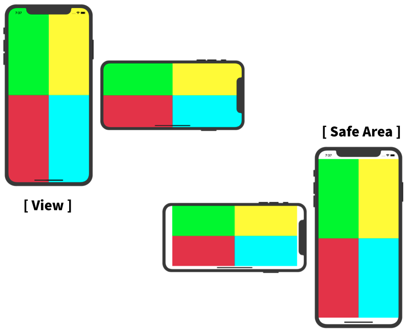
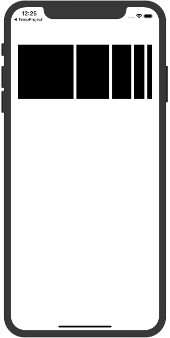
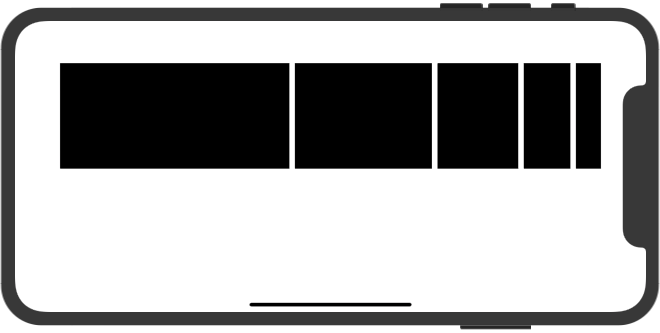
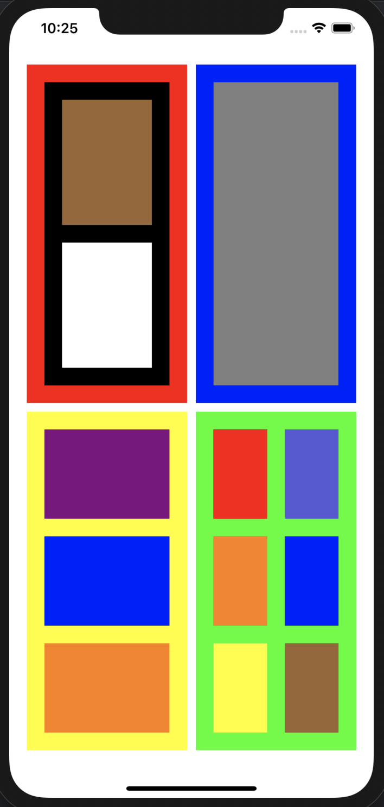

# 오토레이아웃 연습

## 1번
View와 SafeArea를 구분해 오토레이아웃 설정하기

 

## 2번

5개의 뷰를 생성하고 높이는 150으로 통일

   

1. Safe Area Top 과 60 의 거리
2. 가장 왼쪽의 뷰는 leading 20, 가장 오른쪽의 뷰는 trailing 20으로 설정하고 각 view 간의 거리는 8로 고정
3. 각 위치에서 오른쪽에 있는 뷰는 왼쪽 뷰 width 의 0.7배에서 해당 위치의 인덱스만큼 뺀 값을 width 값으로 지님
4. 예시) 2번째 뷰의 width는 1번째 뷰 width의 0.7배보다 1 작게 설정 3번째 뷰의 width는 2번째 뷰 width의 0.7배보다 2 작게 설정

 

## 도전과제

스토리보드로 AutoLayout 사용해서 구현해보기

