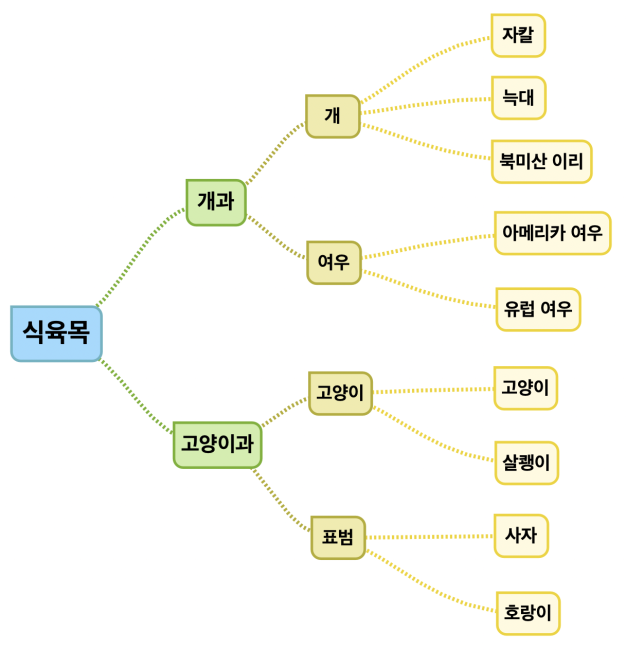

### 과제

* 자연수를 입력받아 원래 숫자를 반대 순서로 뒤집은 숫자를 반환하는 함수

  ex) 123 -> 321 , 10293 -> 39201

  ```swift
  func reverseNum(num: Int) -> Int {
      var quotient: Int = num
      var rest: Int = 0
      var newSum: Int = 0
      
      while quotient >= 10 {
          rest = quotient % 10
          quotient = quotient / 10
          newSum = (newSum + rest) * 10
      }
      
      newSum = newSum + quotient
      return newSum
  }
  let input1: Int = 871131
  print("Reverse of \(input1) is \(reverseNum(num: input1))")
  ```

  
  
* 100 ~ 900 사이의 숫자 중 하나를 입력받아 각 자리의 숫자가 모두 다른지 여부를 반환하는 함수

  ex) true - 123, 310, 369   /  false - 100, 222, 770
  
  ```swift
  func checkAllDif(num: Int) -> Bool {
      var convertArry: [Int] = []
      var quotient: Int = num
      var rest: Int = 0
      var detectSameNumFlag: Bool = false
      
      while quotient >= 10 {
          rest = quotient % 10
          quotient = quotient / 10
          convertArry.append(rest)
      }
      convertArry.append(quotient)
      print(convertArry)
      for i in 0...convertArry.endIndex-2 {
          for j in i+1...convertArry.endIndex-1 {
              print(convertArry[i],"==", convertArry[j],"?")
              if convertArry[i] == convertArry[j] {
                  detectSameNumFlag = true
                  return detectSameNumFlag
              }
              else {
                  detectSameNumFlag = false
              }
          }
      }
      return detectSameNumFlag
  }
  
  let input2: Int = 369
  var theAnswer: Bool = checkAllDif(num: input2)
  
  if theAnswer == true {
      print("The number \(input2) has same number inside of it")
  }
  else {
      print("The number \(input2) doesn't have same number inside of it")
  }
  ```
  
  
### 도전과제

- 주어진 문자 배열에서 중복되지 않는 문자만을 뽑아내 배열로 반환해주는 함수

  ex) ["a", "b", "c", "a", "e", "d", "c"]  ->  ["b", "e" ,"d"]

  ```swift
  func uniqPicker(randomString: [String]) -> [String] {
      var newArry: [String] = []
      for i in randomString {
          if randomString.firstIndex(of: i) == randomString.lastIndex(of: i) {
              newArry.append(i)
          }
          else {
              //do nothing
          }
      }
      return newArry
  }
  let rdString: [String] = ["a","b","c","a","b","d","e","c","f"]
  print("\(rdString) ==> \(uniqPicker(randomString: rdString))")
  ```

  

- 별도로 전달한 식육목 모식도 라는 자료를 보고 Dictionary 자료형에 맞도록 중첩형태로 데이터를 저장하고, 해당 변수에서 표범 하위 분류를 찾아 사자와 호랑이를 출력하기

</img>

```swift
var aniBook: [String: [String: [String]]] = [:]
aniBook["categoryDog"] = ["dog": ["jakal","wolf","iri"], "fox":["americaFox", "EUFox"]]
aniBook["categoryCat"] = ["cat": ["cat","salkeng"], "puma": ["lion","tiger"]]
aniBook

for (key, _) in aniBook { // 좀 이상하다.
//    print(key)
    if key == "categoryCat" {
        for(key, value) in aniBook["categoryCat"]! {
//            print(key)
            if key == "puma" {
                print(value)
            }
            
        }
    }
}
```

