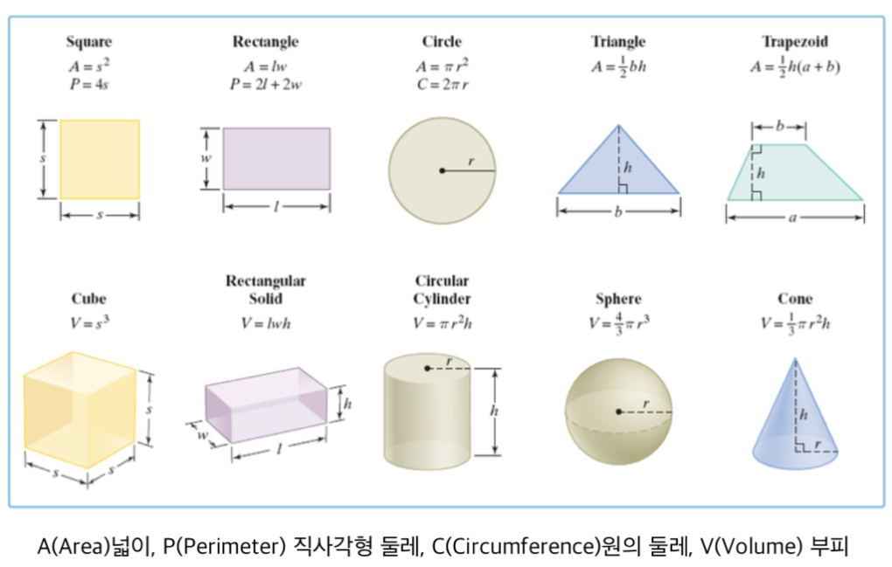

### 과제

#### 1. 다음과 같은 속성(Property)과 행위(Method)를 가지는 클래스 만들어보기.

구현 내용은 자유롭게

** 강아지 (Dog) - 속성: 이름, 나이, 몸무게, 견종 - 행위: 짖기, 먹기

```swift
class Dog {
    let name: String
    let breed: String
    var age: Int
    var weight: Int
    
    func barking(){
        print("Wal!! Wal!!")
    }
    func eating(){
        print("chop chop")
    }
    
    init(name: String, breed: String, age: Int, weight: Int) {
        self.name = name
        self.breed = breed
        self.age = age
        self.weight = weight
    }
}
let myDog: Dog = Dog(name:"Honey", breed: "Maltese", age: 2, weight: 10)
print(myDog.name, myDog.breed, myDog.age, myDog.weight)
```


** 학생 (Student) - 속성: 이름, 나이, 학교명, 학년 - 행위: 공부하기, 먹기, 잠자기

```swift
class Student {
    let name: String
    var age: Int
    var schoolName: String
    var grade: Int
    
    func study() {
        print("study")
    }
    func eat() {
        print("eat")
    }
    func sleep() {
        print("sleep")
    }
    
    init(name: String, age: Int, schoolName: String, grade: Int) {
        self.name = name
        self.age = age
        self.schoolName = schoolName
        self.grade = grade
    }
}
let mySon: Student = Student(name: "Woobin", age: 34, schoolName: "FastCampus", grade: 1)
mySon.schoolName = "Codestates"
print(mySon.name, mySon.age, mySon.schoolName, mySon.grade)
```


** 아이폰(IPhone) - 속성: 기기명, 가격, faceID 기능 여부(Bool) - 행위: 전화 걸기, 문자 전송

```swift
class IPhone {
    let modelname: String
    var price: String
    var faceID: Bool
    
    func makeacall() {
        print("make a call")
    }
    func sendamsg() {
        print("send a message")
    }
    
    init(modelname: String, price: String, faceID: Bool) {
        self.modelname = modelname
        self.price = price
        self.faceID = faceID
    }
}
let myPhone: IPhone = IPhone(modelname: "11pro", price: "1,300,000", faceID: true)
print(myPhone.modelname, myPhone.price, myPhone.faceID)
```


** 커피(Coffee) - 속성: 이름, 가격, 원두 원산지

```swift
class Coffee {
    var name: String
    var origin: String
    var price: String
    
    init(name: String, origin: String, price: String) {
        self.name = name
        self.origin = origin
        self.price = price
    }
}
let myCoffee: Coffee = Coffee(name: "Backs", origin: "Brazil", price: "5,000")
print(myCoffee.name, myCoffee.origin, myCoffee.price)
```


#### 2. 계산기 클래스를 만들고 다음과 같은 기능을 가진 Property 와 Method 정의해보기

** 계산기 (Calculator) - 속성: 현재 값 - 행위: 더하기, 빼기, 나누기, 곱하기, 값 초기화 

ex)

let calculator = Calculator() // 객체생성

calculator.value  // 0

calculator.add(10)    // 10

calculator.add(5)     // 15

calculator.subtract(9)  // 6

calculator.subtract(10) // -4

calculator.multiply(4)   // -16

calculator.multiply(-10) // 160

calculator.divide(10)   // 16

calculator.reset()      // 0

```swift
class Calculator {
    var value: Int
    
    func plus(_ inputval: Int) {
        self.value = self.value + inputval
    }
    func minus(_ inputval: Int) {
        self.value = self.value - inputval
    }
    func mulitple(_ inputval: Int) {
        self.value = self.value * inputval
    }
    func divide(_ inputval: Int) {
        self.value = self.value / inputval
    }
    func reset() {
        self.value = 0
    }
    
    init(value: Int) {
        self.value = value
    }
}
let myCal: Calculator = Calculator(value: 0)
myCal.plus(10)
myCal.value
myCal.mulitple(2)
myCal.value
myCal.minus(-5)
myCal.value
myCal.divide(-5)
myCal.value
myCal.reset()
myCal.value
```


#### 3. 첨부된 그림을 참고하여 각 도형별 클래스를 만들고 각각의 넓이, 둘레, 부피를 구하는 프로퍼티와 메서드 구현하기



```swift
// 한변의 길이만 프로퍼티로 생성
class Square1 {
    var s: Int
    
//    func calcArea(_ input: Int) -> Int {
//        return input * input
//    } // 이 놈은 이 문제상에서는 클래스의 메서드로서 의미가 없는 놈임.
    func calcArea() -> Int {
        return self.s * self.s
    }
  	func circum() -> Int {
      	return self.s * 4
    }
    
    init(s: Int) {
        self.s = s
    }
}

// 한변이 길이와 넓이를 프로퍼티로 생성
class Square2 {
    var s: Int;
    var area: Int;
  	var circum: Int;
    
    func calcArea() -> Int {
        self.area = self.s * self.s;
        return self.area;
    }
  
  	func calcCircum() -> Int {
      	self.circum = self.s * 4
      	return self.circum
    }
    
    init(s: Int, area: Int) {
        self.s = s;
        self.area = area;
    }
}

let mySquare1: Square1 = Square1(s: 0)
let mySquqre2: Square2 = Square2(s: 0, area: 0)
mySquare1.s = 2
mySquare1.calcArea()
mySquqre2.s = 2
mySquqre2.area = 6
mySquqre2.calcArea()
mySquqre2.area // 4. calcArea가 메서드 참조되면서 area 프로퍼티 값이 바뀜.  calcCircum도 동일
mySquqre2.area = 6
mySquqre2.area // 6. area 프로퍼티 값을 직접 바꿔서 바뀜. circum도 동일
```

