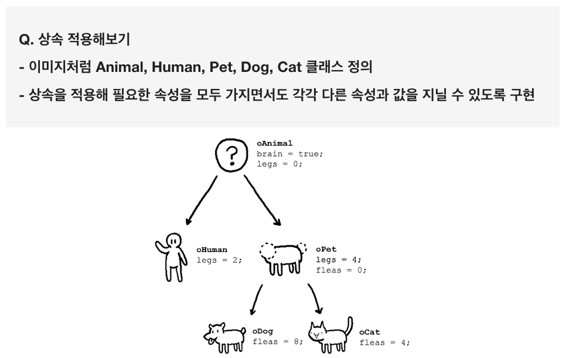

### 과제

</img>

```swift
import UIKit

var str = "Hello, playground"

class oAnimal {
    var brain: Bool = false;
    var leg: Int = 0;
}

class oHuman: oAnimal {
    
}

class oPet: oAnimal {
    var fleas: Int = 0;
}

class oDog: oPet {
    
}

class oCat: oPet {
    
}
let animal: oAnimal = oAnimal();
let human: oHuman = oHuman();
let pet: oPet = oPet();
let dog: oDog = oDog();
let cat: oCat = oCat();


animal.brain;
animal.leg;

print("animal brain: \(animal.brain), animal fleas: nil, animal legs: \(animal.leg)")

human.brain = true;
human.leg = 2;

print("human brain: \(human.brain), human fleas: nil, human legs: \(human.leg)")

pet.brain = true;
pet.leg = 4;

print("pet brain: \(pet.brain), pet fleas: \(pet.fleas), pet legs: \(cat.leg)")

cat.brain = true;
cat.fleas = 4;
cat.leg = 4;

print("cat brain: \(cat.brain), cat fleas: \(cat.fleas), cat legs: \(cat.leg)")

dog.brain = true;
dog.fleas = 8;
dog.leg = 4;

print("dog brain: \(dog.brain), dog fleas: \(dog.fleas), dog legs: \(dog.leg)")

//========결과========
animal brain: false, animal fleas: nil, animal legs: 0
human brain: true, human fleas: nil, human legs: 2
pet brain: true, pet fleas: 0, pet legs: 0
cat brain: true, cat fleas: 4, cat legs: 4
dog brain: true, dog fleas: 8, dog legs: 4
```

